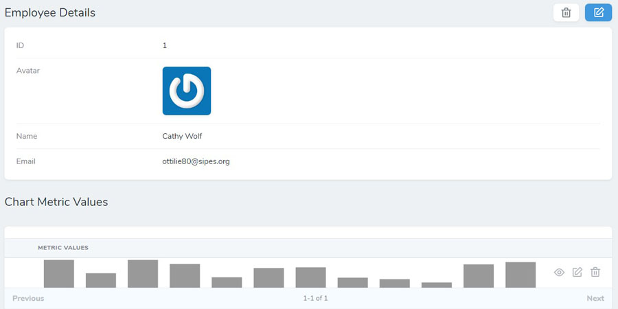

# Nova ChartJS

## Introduction
Nova ChartJs makes it easy to add high/low range charts to Laravel Nova Resources using chart.js!

## Requirements

This Nova resource tool requires Nova 2.0 or higher.

## Installation

You can install this package in a Laravel app that uses [Nova](https://nova.laravel.com) via composer:

```bash
composer require kirschbaum-development/nova-chartjs
```

You'll also need to run migrations to set up a database table for `NovaChartjsMetricValue`

```bash
php artisan migrate
```
## Setup

After setup, your model should include `HasNovaChartjsChart` trait and you must implement the `NovaChartjsChartable` Contract.

You must also define a static `getNovaChartjsSettings` function in the model which should return the required settings for the Chart. All other required methods and relationship defined in the contract are already defined for you in the included trait. You can also override these trait methods directly on your model.

```php
use KirschbaumDevelopment\NovaChartjs\Traits\HasNovaChartjsChart;
use KirschbaumDevelopment\NovaChartjs\Contracts\NovaChartjsChartableContract as ChartableContract;

class User extends Model implements ChartableContract
{
    use HasNovaChartjsChart;

    /**
     * Should return settings for Nova Chart in prescribed format
     *
     * @return array
     */
    public static function getNovaChartjsSettings(): array
    {
        return [
            'type' => 'range',
            'titleProp' => 'name',
            'identProp' => 'id',
            'height' => 400,
            'indexColor' => '#999999',
            'color' => '#FF0000',
            'parameters' => ['January', 'February', 'March', 'April', 'May', 'June', 'July', 'August', 'September', 'October', 'November', 'December'],
            'high' => [80, 40, 62, 79, 80, 90, 79, 90, 90, 90, 92, 91],
            'low' => [8, 7, 12, 19, 12, 10, 19, 9, 10, 20, 12, 11],
            'options' => ['responsive' => true, 'maintainAspectRatio' => false],
        ];
    }

    // ...
}
```
### Adding NovaChartjs Chart

You can add the chart to your Nova resource in three ways

1. Our recommended way of using Nova Chartjs Chart is to add the included Panel `KirschbaumDevelopment\NovaChartjs\NovaChartjsChartablePanel` to your resource's Nova fields


```php

namespace App\Nova;

use KirschbaumDevelopment\NovaChartjs\NovaChartjsChartablePanel;

class User extends Resource
{
    
    //...
    public function fields(Request $request)
    {
        return [
            //...

            new NovaChartjsChartablePanel($this, $request, 'Chart Name'),
        ];
    }
}
``` 
**_NOTE:_** You must pass the `Resource` (i.e. `$this`) and `$request` to the `NovaChartjsChartablePanel` component. As an optional argument you can pass a chart name as the third argument.


2. If you instead want to use NovaChartjsChart inline without a panel you can do so using this code:

```php
namespace App\Nova;

use KirschbaumDevelopment\NovaChartjs\NovaChartjs;

class User extends Resource
{
    
    //...
    public function fields(Request $request)
    {
        return [
            //...

            NovaChartjs::make('Panel Name', 'novaChartjsMetricValue', function () {
                return $this->novaChartjsMetricValue->metric_values;
            })->hideWhenCreating()
                ->chartable($this->resource ?? App::make($request->viaResource()::$model)),
        ];
    }
}
``` 
**_NOTE:_** You can chain the `hideLabel()` method with `make()` function to hide the label and show the chart full screen. You can pass the name of chart as a first argument.


Without `hideLabel()` chart will occupy the full width.


3. You can also display the chart as a relationship table and manage it on a separate page

```php

namespace App\Nova;

use KirschbaumDevelopment\NovaChartjs\NovaChartjsPanel;

class User extends Resource
{
    
    //...
    public function fields(Request $request)
    {
        return [
            //...

            new NovaChartjsPanel('Chart Name'),
        ];
    }
}
``` 


## Settings

You can add following settings to model settings
1. `parameters`: It is a list of parameters label for which chart data will be collected. It should be passed as an array. e.g., ["January, "February", "March"]
2. `high`: An array of high value ranges to be shown in chart.
3. `low`: An array of low value ranges to be shown in chart.
4. `height` and `width`: Dimensions of chart. It is recommended to set height and let chart adjust according to width.
5. `color`: Color value for the base model in chart. 
6. `identProp`: Model property representing the primary key. defaults to `id`.
7. `labelProp`: Model property used for display label in chart. defaults to `id`.
8. `indexColor`: Bar Chart color in index view. Falls back to `color`
9. `highColor` `lowColor` and `fillColor`: Colors for high, low lines and fillColor of chart.
10. `type`: For future expansion. right now this parameter is ignored.
11. `options`: Options are passed directly to ChartJS instance can be used to customize your Chart as detailed in the [documentation](https://www.chartjs.org/docs/latest/)

## Adding Chart Data

After setup, to add chart data for any model, all you need to do is to edit the model after creating it. You will get a list of numeric inputs to add values for each parameter specified in settings.
 


Chart data will also show on Model Index page as a Simple Bar Chart


## Comparing Models
You can compare other related models to the current model using the comparison dropdown


You can add or remove any model to comparison to checkout how models are stacked against each other.


## Changing Comparison Data

Chart comparison data is fetched through trait using a static function `getNovaChartjsComparisonData`. You can override this function in your model to change the comparison data.
```php

namespace App;

use KirschbaumDevelopment\NovaChartjs\Traits\HasNovaChartjsChart;
use KirschbaumDevelopment\NovaChartjs\Contracts\NovaChartjsChartableContract as ChartableContract;

class User extends Model implements ChartableContract
{
    use HasNovaChartjsChart;
    
    //...
    
    
    /**
     * Return a list of all models available for comparison to root model
     *
     * @return \Illuminate\Database\Eloquent\Collection
     */
    public static function getNovaChartjsComparisonData(): array
    {
        return static::with('novaChartjsMetricValue')
            ->has('novaChartjsMetricValue')
            ->get()
            ->toArray();
    }
}
``` 

## To-Do
- [x] Setup Repo
- [x] Create a NovaChartJsMetricValue Model
- [x] Create a HasNovaChartJsChart Trait with relationship and abstract method to return novaChartJsSettings
- [x] Create a basic chart view for NovaChartJsChart Field Type and add it to Detail Field
- [x] Add a list to compare model with other models
- [x] Add option to add another model for comparison
- [x] Add option to remove a model from comparison
- [x] Create NovaChartJsChartMetricEditor
- [x] Add NovaChartJsChartMetricEditor to Form Field
- [ ] Add additional chart types
- [ ] Add optiona for multiple charts

## Class Diagram


## Changelog

Please see [CHANGELOG](CHANGELOG.md) for more information on what has changed recently.

## Contributing

Please see [CONTRIBUTING](CONTRIBUTING.md) for details.

## Security

If you discover any security related issues, please email brandon@kirschbaumdevelopment.com or nathan@kirschbaumdevelopment.com instead of using the issue tracker.

## Sponsorship

Development of this package is sponsored by Kirschbaum Development Group, a developer driven company focused on problem solving, team building, and community. Learn more [about us](https://kirschbaumdevelopment.com) or [join us](https://careers.kirschbaumdevelopment.com)!

## License

The MIT License (MIT). Please see [License File](LICENSE.md) for more information.
