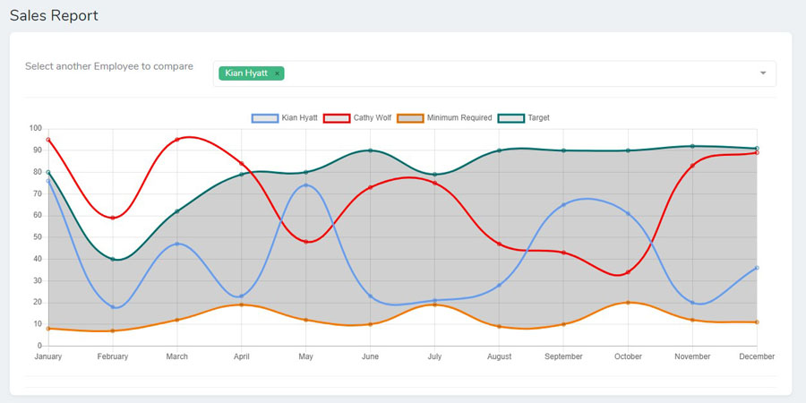
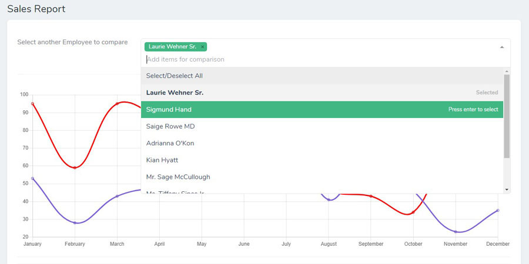

# Nova Chart.js

[](https://packagist.org/packages/kirschbaum-development/nova-chartjs)
[](https://packagist.org/packages/kirschbaum-development/nova-chartjs)
[](https://www.codacy.com/manual/Kirschbaum/nova-chartjs?utm_source=github.com&amp;utm_medium=referral&amp;utm_content=kirschbaum-development/nova-chartjs&amp;utm_campaign=Badge_Grade)

## Introduction
This package allows you to easily add chart.js graphs to your nova resources. This project is under active development, and currently only supports Line and Bar Charts. You are welcome to request or contribute additional charts by opening an issue.



## Requirements

This Nova field requires Nova 2.0 or higher.

## Installation

You can install this package in a Laravel app that uses [Nova](https://nova.laravel.com) via composer:

```bash
composer require kirschbaum-development/nova-chartjs
```

You'll also need to run migrations to set up a database table for `NovaChartjsMetricValue`

```bash
php artisan migrate
```

## Setup

After setup, your model should include the `KirschbaumDevelopment\NovaChartjs\Traits\HasChart` trait and you must implement the `KirschbaumDevelopment\NovaChartjs\Contracts\Chartable` Contract.

You must also define a static `getNovaChartjsSettings` function in the model which should return the required settings for the Chart. All other required methods and relationship defined in the contract are already defined for you in the included trait. You can also override these trait methods directly on your model.

```php
use KirschbaumDevelopment\NovaChartjs\Traits\HasChart;
use KirschbaumDevelopment\NovaChartjs\Contracts\Chartable;

class Employee extends Model implements Chartable
{
    use HasChart;

    /**
     * Should return settings for Nova Chart in prescribed format
     *
     * @return array
     */
    public static function getNovaChartjsSettings(): array
    {
        return [
            'default' => [
                'type' => 'line',
                'titleProp' => 'name',
                'identProp' => 'id',
                'height' => 400,
                'indexColor' => '#999999',
                'color' => '#FF0000',
                'parameters' => ['January', 'February', 'March', 'April', 'May', 'June', 'July', 'August', 'September', 'October', 'November', 'December'],
                'options' => ['responsive' => true, 'maintainAspectRatio' => false],
            ]
        ];
    }

    // ...
}
```
## Adding Custom Datsets

You can also add your own custom datasets to the chart by adding a `getAdditionalDatasets` method on your model


```php
use KirschbaumDevelopment\NovaChartjs\Traits\HasChart;
use KirschbaumDevelopment\NovaChartjs\Contracts\Chartable;

class Employee extends Model implements Chartable
{
    use HasChart;
    
    //...

    /**
     * Return a list of additional datasets added to chart
     *
     * @return array
     */
    public function getAdditionalDatasets(): array
    {
        return [
            'default' => [
                [
                    'label' => 'Average Sales',
                    'borderColor' => '#f87900',
                    'data' => [80, 40, 62, 79, 80, 90, 79, 90, 90, 90, 92, 91],
                ],
            ]
        ];
    }

    // ...
}
```
You can read more about adding custom datasets in the [official chart.js documentation](https://www.chartjs.org/docs/latest/)

### Creating a range chart

To create a range chart you can pass on two additional datasets representing an upper and lower range and set the fill and background color property for the first data point.

```php
use KirschbaumDevelopment\NovaChartjs\Traits\HasChart;
use KirschbaumDevelopment\NovaChartjs\Contracts\Chartable;

class Employee extends Model implements Chartable
{
    use HasChart;
    
    //...

    /**
     * Return a list of additional datasets added to chart
     *
     * @return array
     */
    public function getAdditionalDatasets(): array
    {
        return [
            'default' => [
                [
                    'label' => 'Minimum Required',
                    'borderColor' => '#f87900',
                    'fill' => '+1',
                    'backgroundColor' => 'rgba(20,20,20,0.2)',//For bar charts, this will be the fill color of the bar
                    'data' => [8, 7, 12, 19, 12, 10, 19, 9, 10, 20, 12, 11],
                ],
                [
                    'label' => 'Target',
                    'borderColor' => '#007979',
                    'fill' => false,
                    'data' => [80, 40, 62, 79, 80, 90, 79, 90, 90, 90, 92, 91],
                ],
            ]
        ];
    }

    // ...
}
```

## Adding Chart

You can add the chart to your Nova resource in three ways

1. Our recommended way of using Nova Chartjs Chart is to add the included Panel `KirschbaumDevelopment\NovaChartjs\InlinePanel` to your resource's Nova fields


```php
namespace App\Nova;

use KirschbaumDevelopment\NovaChartjs\InlinePanel;

class Employee extends Resource
{
    
    //...
    public function fields(Request $request)
    {
        return [
            //...

            new InlinePanel($this, $request, 'Chart Title'),
        ];
    }
}
``` 
**_NOTE:_** You must pass the `Resource` (i.e. `$this`) and `$request` to the `InlinePanel` component. 

As an optional argument you can pass a chart title as the third argument, `showLabel` as fourth argument, `notEditable` as the fifth argument and `hideFromIndex` as the sixth argument. You can pass `chartName` as an optional seventh parameter if you want to add more than one charts to same model. 

If you want to attach your chart to a JSON field directly on model you can set the optional eighth parameter `isField` as true.

```php
//...
new InlinePanel($this, $request, 'Attendance', true, false, false, 'attendance', true),
//...
```


2. If you instead want to use the Chart inline without a panel you can do so using this code:

```php
namespace App\Nova;

use KirschbaumDevelopment\NovaChartjs\NovaChartjs;

class Employee extends Resource
{
    
    //...
    public function fields(Request $request)
    {
        return [
            //...

            NovaChartjs::make('Panel Name', 'novaChartjsMetricValue', function () {
                return optional($this->novaChartjsMetricValue()->where('chart_name', $chartName)->first())->metric_values ?? [];
            }),
        ];
    }
}
``` 


**_NOTE:_** You can pass the name of the chart as the first argument for the `make()` function. You can also chain the `showLabel()` and `notEditable()` methods to show the label and prevent editing the model data via the resource. 

Without `showLabel()` chart will occupy the full width even in Inline Mode.

3. You can also display the chart as a relationship table and manage it on a separate page

```php

namespace App\Nova;

use KirschbaumDevelopment\NovaChartjs\RelationshipPanel;

class Employee extends Resource
{
    
    //...
    public function fields(Request $request)
    {
        return [
            //...

            new RelationshipPanel('Chart Name'),
        ];
    }
}
``` 


## Adding Multiple Charts

You can add multiple charts to your Nova resource by specifying a chart identifier.

```php
namespace App\Nova;

use KirschbaumDevelopment\NovaChartjs\InlinePanel;

class Employee extends Resource
{
    
    //...
    public function fields(Request $request)
    {
        return [
            //...

            new InlinePanel($this, $request, 'First Chart'),
            new InlinePanel($this, $request, 'Second Chart', true, false, false, 'second_chart'),
        ];
    }
}
``` 
**_NOTE:_** If no explicit identifier is specified `default` will be used as the identifier for that chart. 

You can use the chart identifiers to specify separate additional datasets and settings for each charts.

```php
use KirschbaumDevelopment\NovaChartjs\Traits\HasChart;
use KirschbaumDevelopment\NovaChartjs\Contracts\Chartable;

class Employee extends Model implements Chartable
{
    use HasChart;

    /**
     * Should return settings for Nova Chart in prescribed format
     *
     * @return array
     */
    public static function getNovaChartjsSettings(): array
    {
        return [
            'default' => [
                'type' => 'line',
                'titleProp' => 'name',
                'identProp' => 'id',
                'height' => 400,
                'indexColor' => '#999999',
                'color' => '#FF0000',
                'parameters' => ['January', 'February', 'March', 'April', 'May', 'June', 'July', 'August', 'September', 'October', 'November', 'December'],
                'options' => ['responsive' => true, 'maintainAspectRatio' => false],
            ],
            'second_chart' => [
                'type' => 'bar',
                'titleProp' => 'name',
                'identProp' => 'id',
                'height' => 400,
                'indexColor' => '#999999',
                'color' => '#FF0000',
                'parameters' => ['Q1', 'Q2', 'Q3', 'Q4'],
                'options' => ['responsive' => true, 'maintainAspectRatio' => false],
            ]
        ];
    }

    // ...
}
```

## Settings

You can add following settings to model settings
1. `parameters`: It is a list of parameters label for which chart data will be collected. It should be passed as an array. e.g., ["January, "February", "March"]
2. `height` and `width`: Dimensions of chart. It is recommended to set height and let chart adjust according to width.
3. `color`: Color value for the base model in chart. 
4. `identProp`: Model property representing the primary key. defaults to `id`.
5. `labelProp`: Model property used for display label in chart. defaults to `id`.
6. `indexColor`: Bar Chart color in index view. Falls back to `color`
7. `type`: `line` or `bar`. defaults to `line`.
8. `options`: Options are passed directly to ChartJS instance can be used to customize your Chart as detailed in the [documentation](https://www.chartjs.org/docs/latest/)

## Adding Chart Data

After setup, to add chart data for any model, all you need to do is to edit the model after creating it. You will get a list of numeric inputs to add values for each parameter specified in settings.
 


Chart data will also show on Model Index page as a Simple Bar Chart


## Comparing Models
You can compare other related models to the current model using the comparison dropdown



You can add or remove any model to comparison to checkout how models are stacked against each other.


## Changing Comparison Data

Chart comparison data is fetched through trait using a static function `getNovaChartjsComparisonData`. You can override this function in your model to change the comparison data.
```php
namespace App;

use KirschbaumDevelopment\NovaChartjs\Traits\HasChart;
use KirschbaumDevelopment\NovaChartjs\Contracts\Chartable;

class Employee extends Model implements Chartable
{
    use HasChart;
    
    //...
    
    
    /**
     * Return a list of all models available for comparison to root model
     *
     * @return \Illuminate\Database\Eloquent\Collection
     */
    public static function getNovaChartjsComparisonData(): array
    {
        return static::with('novaChartjsMetricValue')
            ->has('novaChartjsMetricValue')
            ->get()            
            ->map(function ($chartData) use ($chartName) {
                $chartData->setAttribute(
                    'novaChartjsComparisonData', 
                    optional($chartData->novaChartjsMetricValue()->where('chart_name', $chartName)->first())->metric_values
                );
                return $chartData;
            })
            ->reject(function ($chartData) {
                return empty($chartData->novaChartjsComparisonData);
            })
            ->values()
            ->toArray();
    }
}
``` 

## Changelog

Please see [CHANGELOG](CHANGELOG.md) for more information on what has changed recently.

## Contributing

Please see [CONTRIBUTING](CONTRIBUTING.md) for details.

## Security

If you discover any security related issues, please email brandon@kirschbaumdevelopment.com or nathan@kirschbaumdevelopment.com instead of using the issue tracker.

## Sponsorship

Development of this package is sponsored by Kirschbaum Development Group, a developer driven company focused on problem solving, team building, and community. Learn more [about us](https://kirschbaumdevelopment.com) or [join us](https://careers.kirschbaumdevelopment.com)!

## License

The MIT License (MIT). Please see [License File](LICENSE.md) for more information.
